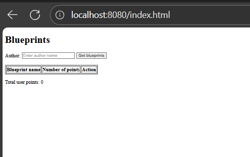

# Laboratorio 5 - Construción de un cliente 'grueso' con un API REST, HTML5, Javascript y CSS3. Parte I.
## Sebastian Galvis Briceño
El objetivo del laboratorio será llevar a cabo el desarrollo de un cliente grueso para el API de Blueprints de la forma:


* Al oprimir 'Get blueprints', consulta los planos del usuario dado en el formulario. Por ahora, si la consulta genera un error, sencillamente no se mostrará nada.
* Al hacer una consulta exitosa, se debe mostrar un mensaje que incluya el nombre del autor, y una tabla con: el nombre de cada plano de autor, el número de puntos del mismo, y un botón para abrirlo. Al final, se debe mostrar el total de puntos de todos los planos (suponga, por ejemplo, que la aplicación tienen un modelo de pago que requiere dicha información).
* Al seleccionar uno de los planos, se debe mostrar el dibujo del mismo. Por ahora, el dibujo será simplemente una secuencia de segmentos de recta realizada en el mismo orden en el que vengan los puntos.

## Ajustes Backend
Empezamos por agregar al repositorio todo lo desarrollado en el **[Laboratorio 4](https://github.com/sebRedi/ARSWLAB04)**.

Incluiremos dentro de las dependencias de Maven los 'webjars' de jQuery y Bootstrap (esto permite tener localmente dichas librerías de JavaScript al momento de construír el proyecto):

``` xml
<dependency>
    <groupId>org.webjars</groupId>
    <artifactId>webjars-locator</artifactId>
    <version>0.46</version>
</dependency>

<dependency>
    <groupId>org.webjars</groupId>
    <artifactId>bootstrap</artifactId>
    <version>3.3.7</version>
</dependency>

<dependency>
    <groupId>org.webjars</groupId>
    <artifactId>jquery</artifactId>
    <version>3.1.0</version>
</dependency>                
```

## Front-End - Vistas

1. Cree el directorio donde residirá la aplicación JavaScript. Como se está usando SpringBoot, la ruta para poner en el mismo contenido estático (páginas Web estáticas, aplicaciones HTML5/JS, etc) es:
    ```
    src/main/resources/static
    ```

2. Cree, en el directorio anterior, la página index.html, sólo con lo básico: título, campo para la captura del autor, botón de 'Get blueprints', campo donde se mostrará el nombre del autor seleccionado, la tabla HTML donde se mostrará el listado de planos (con sólo los encabezados), y un campo donde se mostrará el total de puntos de los planos del autor. Recuerde asociarle identificadores a dichos componentes para facilitar su búsqueda mediante selectores.

   **Desarrollo:** Tal y como se pide, hacemos el siguiente ***index.html*** con lo simple, asociando identificadores a cada componente:
   ``` html
   <!DOCTYPE html>
   <html lang="en">
   <head>
       <meta charset="UTF-8">
       <title>Blueprints</title>
   </head>
   <body>
   <h1>Blueprints</h1>
   
   <!-- Espacio para el campo para ingresar el autor -->
   <label for="authorInput">Author: </label>
   <input type="text" id="authorInput" placeholder="Enter author name">
   <button id="getBlueprintsBtn">Get blueprints</button>
   
   <!-- Espacio para el nombre de autor del autor seleccionado -->
   <h2 id="selectedAuthor"></h2>
   
   <!-- Espacio para la tabla de planos -->
   <table border="1" id="blueprintsTable">
       <thead>
       <tr>
           <th>Blueprint name</th>
           <th>Number of points</th>
           <th>Action</th>
       </tr>
       </thead>
       <tbody>
       <!-- Espacio para agregar dinámicamente los planos -->
       </tbody>
   </table>
   
   <!-- Espacio para el total de puntos -->
   <p>Total user points: <span id="totalPoints">0</span></p>
   </body>
   </html>
   ```
   **Resultado:**

   

   Como puede verse, el archivo está plano, sin estilos todavía. Así que el navegador por defecto muestra todo con tipografía pequeña, sin márgenes ni separación.


3. En el elemento `<head>` de la página, agregamos las referencias a las librerías de jQuery, Bootstrap y a la hoja de estilos de Bootstrap:
