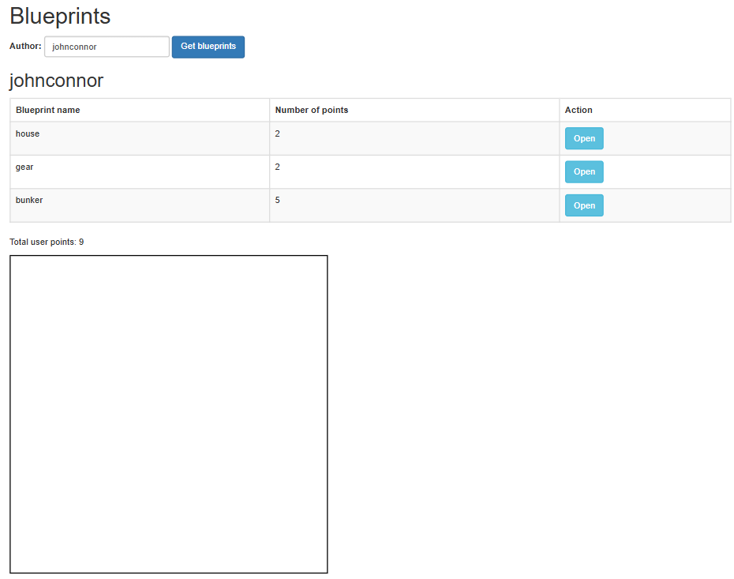
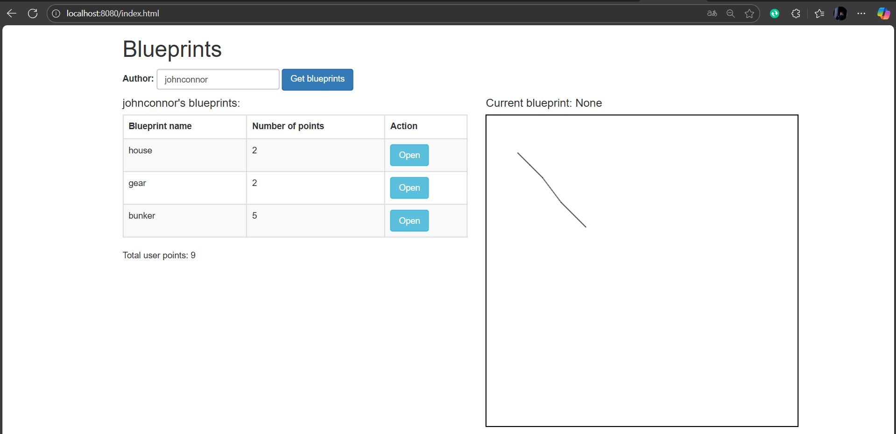

# Laboratorio 5 - Construción de un cliente 'grueso' con un API REST, HTML5, Javascript y CSS3. Parte I.
## Sebastian Galvis Briceño
El objetivo del laboratorio será llevar a cabo el desarrollo de un cliente grueso para el API de Blueprints de la forma:


* Al oprimir 'Get blueprints', consulta los planos del usuario dado en el formulario. Por ahora, si la consulta genera un error, sencillamente no se mostrará nada.
* Al hacer una consulta exitosa, se debe mostrar un mensaje que incluya el nombre del autor, y una tabla con: el nombre de cada plano de autor, el número de puntos del mismo, y un botón para abrirlo. Al final, se debe mostrar el total de puntos de todos los planos (suponga, por ejemplo, que la aplicación tienen un modelo de pago que requiere dicha información).
* Al seleccionar uno de los planos, se debe mostrar el dibujo del mismo. Por ahora, el dibujo será simplemente una secuencia de segmentos de recta realizada en el mismo orden en el que vengan los puntos.

## Ajustes Backend
Empezamos por agregar al repositorio todo lo desarrollado en el **[Laboratorio 4](https://github.com/sebRedi/ARSWLAB04)**.

Incluiremos dentro de las dependencias de Maven los 'webjars' de jQuery y Bootstrap (esto permite tener localmente dichas librerías de JavaScript al momento de construír el proyecto):

``` xml
<dependency>
    <groupId>org.webjars</groupId>
    <artifactId>webjars-locator</artifactId>
    <version>0.46</version>
</dependency>

<dependency>
    <groupId>org.webjars</groupId>
    <artifactId>bootstrap</artifactId>
    <version>3.3.7</version>
</dependency>

<dependency>
    <groupId>org.webjars</groupId>
    <artifactId>jquery</artifactId>
    <version>3.1.0</version>
</dependency>                
```

## Front-End - Vistas

1. Cree el directorio donde residirá la aplicación JavaScript. Como se está usando SpringBoot, la ruta para poner en el mismo contenido estático (páginas Web estáticas, aplicaciones HTML5/JS, etc) es:
    ```
    src/main/resources/static
    ```

2. Cree, en el directorio anterior, la página index.html, sólo con lo básico: título, campo para la captura del autor, botón de 'Get blueprints', campo donde se mostrará el nombre del autor seleccionado, la tabla HTML donde se mostrará el listado de planos (con sólo los encabezados), y un campo donde se mostrará el total de puntos de los planos del autor. Recuerde asociarle identificadores a dichos componentes para facilitar su búsqueda mediante selectores.

   **Desarrollo:** Tal y como se pide, hacemos el siguiente ***index.html*** con lo simple, asociando identificadores a cada componente:
   ``` html
   <!DOCTYPE html>
   <html lang="en">
   <head>
       <meta charset="UTF-8">
       <title>Blueprints</title>
   </head>
   <body>
   <h1>Blueprints</h1>
   
   <!-- Espacio para el campo para ingresar el autor -->
   <label for="authorInput">Author: </label>
   <input type="text" id="authorInput" placeholder="Enter author name">
   <button id="getBlueprintsBtn">Get blueprints</button>
   
   <!-- Espacio para el nombre de autor del autor seleccionado -->
   <h2 id="selectedAuthor"></h2>
   
   <!-- Espacio para la tabla de planos -->
   <table border="1" id="blueprintsTable">
       <thead>
       <tr>
           <th>Blueprint name</th>
           <th>Number of points</th>
           <th>Action</th>
       </tr>
       </thead>
       <tbody>
       <!-- Espacio para agregar dinámicamente los planos -->
       </tbody>
   </table>
   
   <!-- Espacio para el total de puntos -->
   <p>Total user points: <span id="totalPoints">0</span></p>
   </body>
   </html>
   ```
   **Resultado:**

   

   Como puede verse, el archivo está plano, sin estilos todavía. Así que el navegador por defecto muestra todo con tipografía pequeña, sin márgenes ni separación.


3. En el elemento `<head>` de la página, agregamos las referencias a las librerías de jQuery, Bootstrap y a la hoja de estilos de Bootstrap:
   ``` html
   <head>
       <title>Blueprints</title>
       <meta charset="UTF-8">
       <meta name="viewport" content="width=device-width, initial-scale=1.0">
   
       <script src="/webjars/jquery/jquery.min.js"></script>
       <script src="/webjars/bootstrap/3.3.7/js/bootstrap.min.js"></script>
       <link rel="stylesheet"
             href="/webjars/bootstrap/3.3.7/css/bootstrap.min.css" />
   </head>
   ```
   
   **Desarrollo:** Aprovechado que realizamos esta modificación, agrupamos todo dentro de un contenedor y aplicamos clases de Bootstrap. Dejando la clase de la forma:

   ``` html
   <body class="container mt-4">
   <h1 class="mb-4">Blueprints</h1>
   
   <!-- Campo de autor -->
   <div class="form-inline mb-3">
       <label for="authorInput" class="mr-2">Author: </label>
       <input type="text" id="authorInput" class="form-control mr-2" placeholder="Enter author name">
       <button id="getBlueprintsBtn" class="btn btn-primary">Get blueprints</button>
   </div>
   
   <!-- Autor seleccionado -->
   <h2 id="selectedAuthor" class="mb-3"></h2>
   
   <!-- Tabla de planos -->
   <table class="table table-striped table-bordered w-75">
       <thead class="thead-dark">
       <tr>
           <th>Blueprint name</th>
           <th>Number of points</th>
           <th>Action</th>
       </tr>
       </thead>
       <tbody id="blueprintsTable">
       </tbody>
   </table>
   
   <!-- Total de puntos -->
   <p class="font-weight-bold">Total user points: <span id="totalPoints">0</span></p>
   </body>
   ```
   
   **Resultado:**

   


4. Suba la aplicación (mvn spring-boot:run), y rectifique:

   1. Que la página sea accesible desde:
   ```
   http://localhost:8080/index.html
   ```
   2. Al abrir la consola de desarrollador del navegador, NO deben aparecer mensajes de error 404 (es decir, que las librerías de JavaScript se cargaron correctamente). Front-End - Lógica
   
   **Desarrollo:** Tras llevar a cabo este procedimiento, vemos que es accesible mediante el enlace solicitado y no se genera ningún error.


## Front-End - Lógica

1. Ahora, va a crear un Módulo JavaScript que, a manera de controlador, mantenga los estados y ofrezca las operaciones requeridas por la vista. Para esto tenga en cuenta el patrón Módulo de JavaScript, y cree un módulo en la ruta ***static/js/app.js*** .
   
   **Desarrollo:** La implementación del módulo fue la siguiente:
   ``` js
   var app = (function () {
       // Estado privado
       var _author = null;
       var _blueprints = [];
   
       // Función privada para calcular puntos totales
       function _calculateTotalPoints() {
           return _blueprints.map(bp => bp.points.length)
               .reduce((a, b) => a + b, 0);
       }
   
       // Función privada para dibujar un blueprint en canvas
       function _drawBlueprint(bp) {
           var canvas = document.getElementById("blueprintCanvas");
           var ctx = canvas.getContext("2d");
           ctx.clearRect(0, 0, canvas.width, canvas.height); // limpiar antes de dibujar
   
           if (bp.points.length > 0) {
               ctx.beginPath();
               ctx.moveTo(bp.points[0].x, bp.points[0].y);
               for (var i = 1; i < bp.points.length; i++) {
                   ctx.lineTo(bp.points[i].x, bp.points[i].y);
               }
               ctx.stroke();
           }
       }
   
       // API pública del módulo
       return {
           setAuthor: function (authorName) {
               _author = authorName;
           },
   
           getBlueprints: function () {
               return $.get("/blueprints/" + _author, function (data) {
                   _blueprints = data;
                   $("#selectedAuthor").text(_author);
   
                   // construir tabla
                   var table = $("#blueprintsTable");
                   table.empty();
                   data.forEach(bp => {
                       var row = `<tr>
                           <td>${bp.name}</td>
                           <td>${bp.points.length}</td>
                           <td><button class="btn btn-info" onclick="app.openBlueprint('${bp.name}')">Open</button></td>
                       </tr>`;
                       table.append(row);
                   });
   
                   $("#totalPoints").text(_calculateTotalPoints());
               });
           },
   
           openBlueprint: function (bpName) {
               var bp = _blueprints.find(b => b.name === bpName);
               if (bp) {
                   _drawBlueprint(bp);
               }
           }
       };
   })();
   ```
   
2. Copie el módulo provisto (apimock.js) en la misma ruta del módulo antes creado. En éste agréguele más planos (con más puntos) a los autores 'quemados' en el código.
   
   **Desarrollo:** Agregamos un nuevo autor y llenamos el mock con más planos, dejándolo de la forma:
   ``` js
   //@author hcadavid
   
   apimock=(function(){
   
       var mockdata=[];
   
       mockdata["johnconnor"]=[
           {author:"johnconnor","points":[{"x":150,"y":120},{"x":215,"y":115}],"name":"house"},
           {author:"johnconnor","points":[{"x":340,"y":240},{"x":15,"y":215}],"name":"gear"},
           {author:"johnconnor","points":[
                   {"x":50,"y":60},{"x":70,"y":80},{"x":90,"y":100},
                   {"x":120,"y":140},{"x":160,"y":180}
               ],"name":"bunker"}
       ];
   
       mockdata["maryweyland"]=[
           {author:"maryweyland","points":[{"x":140,"y":140},{"x":115,"y":115}],"name":"house2"},
           {author:"maryweyland","points":[{"x":140,"y":140},{"x":115,"y":115}],"name":"gear2"},
           {author:"maryweyland","points":[
                   {"x":200,"y":200},{"x":220,"y":240},{"x":260,"y":200},
                   {"x":300,"y":250},{"x":340,"y":220},{"x":380,"y":260}
               ],"name":"spaceship"}
       ];
   
       mockdata["sarahconnor"]=[
           {author:"sarahconnor","points":[
                   {"x":10,"y":10},{"x":30,"y":50},{"x":60,"y":40},
                   {"x":100,"y":80},{"x":140,"y":60}
               ],"name":"skynet-lab"}
       ];
   
       return {
           getBlueprintsByAuthor:function(authname,callback){
               callback(
                   mockdata[authname]
               );
           },
   
           getBlueprintsByNameAndAuthor:function(authname,bpname,callback){
               callback(
                   mockdata[authname].find(function(e){return e.name===bpname})
               );
           }
       }
   
   })();
   
   /*
   Example of use:
   var fun=function(list){
       console.info(list);
   }
   
   apimock.getBlueprintsByAuthor("johnconnor",fun);
   apimock.getBlueprintsByNameAndAuthor("johnconnor","house",fun);
   */
   ```

3. Agregamos la importación de los dos nuevos módulos a la página HTML (después de las importaciones de las librerías de jQuery y Bootstrap):
   ``` html
   <script src="js/apimock.js"></script>
   <script src="js/app.js"></script>
   ```

4. Haga que el módulo antes creado mantenga de forma privada:
   * El nombre del autor seleccionado.
   * El listado de nombre y tamaño de los planos del autor seleccionado. Es decir, una lista objetos, donde cada objeto tendrá dos propiedades: nombre de plano, y número de puntos del plano.
   
   Junto con una operación pública que permita cambiar el nombre del autor actualmente seleccionado.

   **Desarrollo:** Dado que este es el objetivo de utilizar el patrón módulo, ya nos encargamos de verificar que nuestro módulo funcionara de esta forma cuando lo creamos.
   
   ``` js
   setAuthor: function (authorName) {
            _author = authorName;
        },
   ```

5. Agregue al módulo 'app.js' una operación pública que permita actualizar el listado de los planos, a partir del nombre de su autor (dado como parámetro). Para hacer esto, dicha operación debe invocar la operación 'getBlueprintsByAuthor' del módulo 'apimock' provisto, enviándole como callback una función que:
   * Tome el listado de los planos, y le aplique una función 'map' que convierta sus elementos a objetos con sólo el nombre y el número de puntos.
   * Sobre el listado resultante, haga otro 'map', que tome cada uno de estos elementos, y a través de jQuery agregue un elemento <tr> (con los respectvos <td>) a la tabla creada en el punto 4. Tenga en cuenta los selectores de jQuery y los tutoriales disponibles en línea. Por ahora no agregue botones a las filas generadas.
   * Sobre cualquiera de los dos listados (el original, o el transformado mediante 'map'), aplique un 'reduce' que calcule el número de puntos. Con este valor, use jQuery para actualizar el campo correspondiente dentro del DOM.

   **Desarrollo:** Al igual que en el anterior inciso, ya fué desarrollado de la forma:
   
   ``` js
   getBlueprints: function () {
            return $.get("/blueprints/" + _author, function (data) {
                _blueprints = data;
                $("#selectedAuthor").text(_author);

                // construir tabla
                var table = $("#blueprintsTable");
                table.empty();
                data.forEach(bp => {
                    var row = `<tr>
                        <td>${bp.name}</td>
                        <td>${bp.points.length}</td>
                        <td><button class="btn btn-info" onclick="app.openBlueprint('${bp.name}')">Open</button></td>
                    </tr>`;
                    table.append(row);
                });

                $("#totalPoints").text(_calculateTotalPoints());
            });
        },
   ```
   
6. Asociamos la operación antes creada (la de app.js) al evento 'on-click' del botón de consulta de la página, agregando un bloque `<script>` al final del ***index.html*** que ya teníamos

   ``` html
   <script>
       $(document).ready(function () {
           $("#getBlueprintsBtn").click(function () {
               var author = $("#authorInput").val();
               app.setAuthor(author);
               app.getBlueprints();
           });
       });
   </script>
   ```

7. Verifique el funcionamiento de la aplicación. Inicie el servidor, abra la aplicación HTML5/JavaScript, y rectifique que al ingresar un usuario existente, se cargue el listado del mismo.
   
   **Desarrollo:** Antes de hacer la prueba es muy importante tener en cuenta que los datos mockeados, lógicamente, no están en el backend, así que será necesario cambiar la línea
   ``` js
   (35) return $.get("/blueprints/" + _author, function (data) {
   ```
   por
   ``` js
   return apimock.getBlueprintsByAuthor(_author, function (data) {
   ```
   
   Antes de proceder con la prueba, agregaremos el siguiente canvas justo antes del bloque creado en ***index.html***:

   ``` html
   <!-- Canvas para dibujar -->
   <canvas id="blueprintCanvas" width="500" height="500" style="border:1px solid black;"></canvas>
   ```
   
   Una vez contamos con esto, realizamos la prueba:

   


## Toques finales
Para obtener un diseño más fiel al mockup proporcionado al inicio del laboratorio, modificamos el ***index.html*** de la forma:
``` html
<!DOCTYPE html>
<html lang="en">
<head>
    <title>Blueprints</title>
    <meta charset="UTF-8">
    <meta name="viewport" content="width=device-width, initial-scale=1.0">

    <script src="/webjars/jquery/3.1.0/jquery.min.js"></script>
    <script src="/webjars/bootstrap/3.3.7/js/bootstrap.min.js"></script>
    <link rel="stylesheet" href="/webjars/bootstrap/3.3.7/css/bootstrap.min.css" />

    <!-- Módulos de la aplicación -->
    <script src="js/apimock.js"></script>
    <script src="js/app.js"></script>
</head>
<body class="container mt-4">
<h1 class="mb-4">Blueprints</h1>

<!-- Campo de autor -->
<div class="form-inline mb-4">
    <label for="authorInput" class="mr-2 font-weight-bold">Author: </label>
    <input type="text" id="authorInput" class="form-control mr-2" placeholder="Enter author name">
    <button id="getBlueprintsBtn" class="btn btn-primary">Get blueprints</button>
</div>

<div class="row">
    <!-- Columna izquierda: lista de planos -->
    <div class="col-md-6">
        <h4><span id="selectedAuthor"></span>'s blueprints:</h4>
        <table class="table table-striped table-bordered">
            <thead class="thead-dark">
            <tr>
                <th>Blueprint name</th>
                <th>Number of points</th>
                <th>Action</th>
            </tr>
            </thead>
            <tbody id="blueprintsTable">
            </tbody>
        </table>
        <p class="font-weight-bold">Total user points: <span id="totalPoints">0</span></p>
    </div>

    <!-- Columna derecha: blueprint actual -->
    <div class="col-md-6">
        <h4>Current blueprint: <span id="currentBlueprint">None</span></h4>
        <canvas id="blueprintCanvas" width="500" height="500" style="border:1px solid black;"></canvas>
    </div>
</div>

<!-- Asociación del evento al botón -->
<script>
    $(document).ready(function () {
        $("#getBlueprintsBtn").click(function () {
            var author = $("#authorInput").val();
            app.setAuthor(author);
            app.getBlueprints();
        });
    });
</script>
</body>
</html>
```

**Resultado:**



